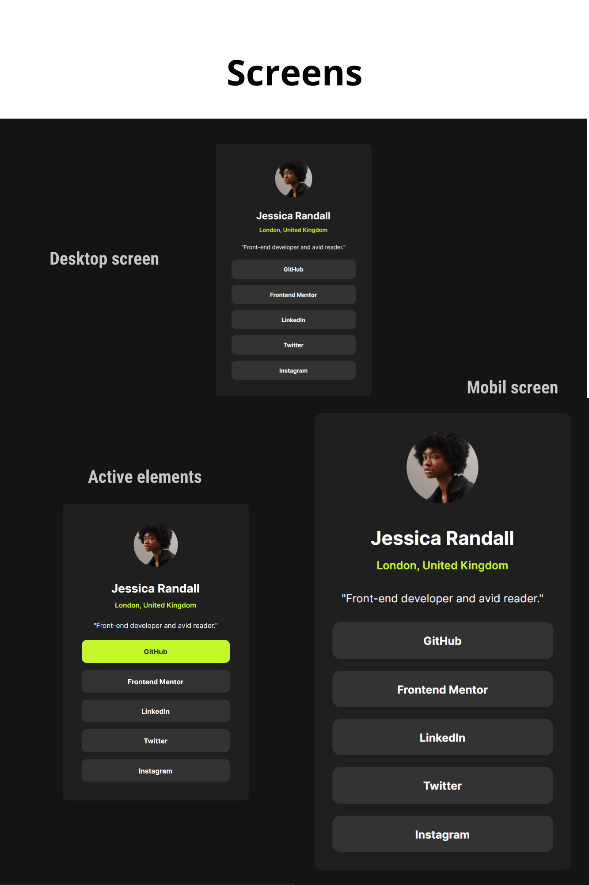

Social links profile (Card)

This is my solution to the Social links profile challenge on Frontend Mentor

## Table of contents

- [Overview](#overview)
  - [The challenge](#the-challenge)
  - [Screenshot](#screenshot)
  - [Links](#links)
- [My process](#my-process)
  - [Built with](#built-with)
- [Author](#author)

## Overview

### The challenge

Users should be able to:

- See hover and focus states for the interactive elements on the page, like the links
- Responsive desing for mobile, tablet and desktop

### Screenshot

### Links

- Solution URL: [Repo](https://github.com/oppahero/social-links-profile)
- Live Site URL: [Demo](https://oppahero.github.io/social-links-profile/)

## My process

### Built with

- Semantic HTML5 markup
- CSS custom properties
- Flexbox
- Mobile-first workflow

## Author

- Frontend Mentor - [@oppahero](https://www.frontendmentor.io/profile/oppahero)
